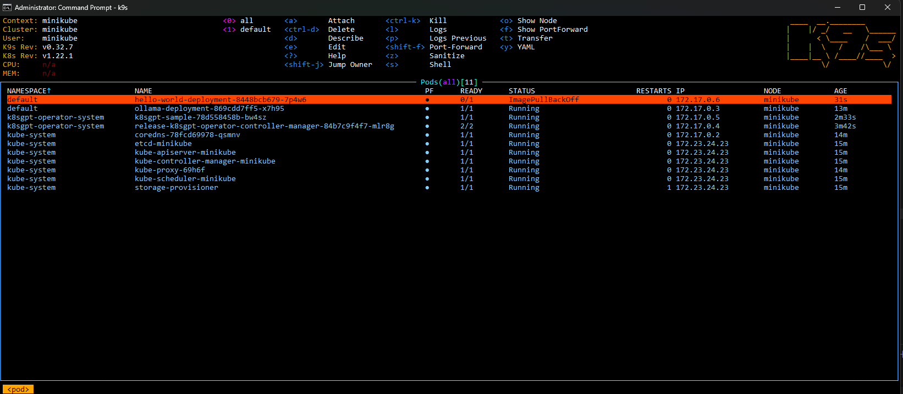
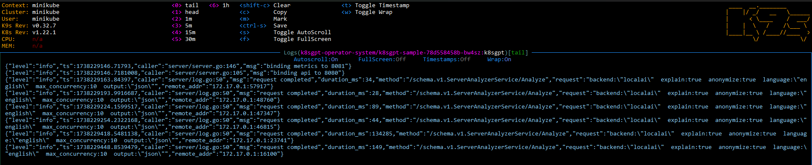
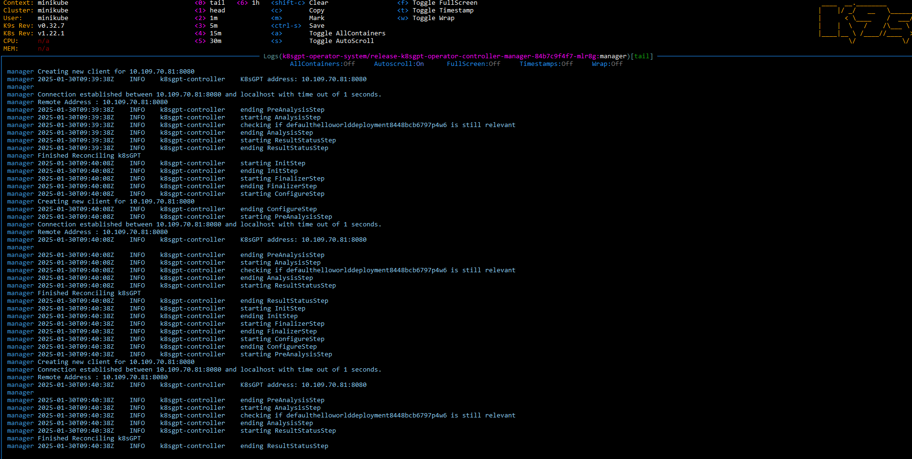
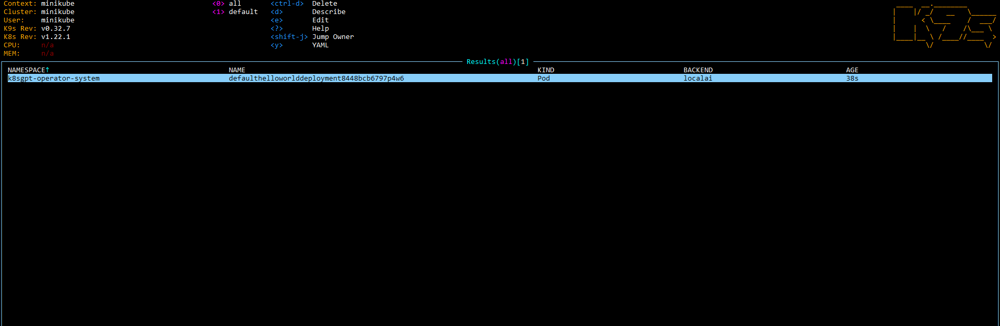
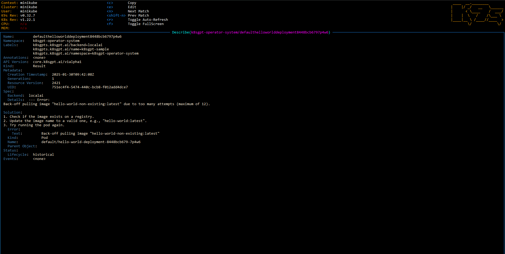

# Integrating k8sgpt-ai with a local k8s cluster #

## Example local k8s clusters ##
- ### Minikube
  - For this POC I allocated 7GB of ram to minikube but you can go lower
- ### Rancher Desktop
- ### Docker Desktop

## Steps (will be improved for efficiency in the future)
- kubectl apply -f ./ollama.yml
  - This will create a deployment using the ollama/ollama:latest image
  - That is where the AI model will be hosted
  - The k8sgpt operator will need to access this pod so a service is also created
- shell into the ollama pod to run the following command: <b><i>ollama pull llama3.2</i></b>
  - The model used for this POC is lightweight with 3b parameters, but can be changed to an even lighter one with 1b parameters if resources are scarce
  - You can try to use another model from https://ollama.com/library, keep in mind that bigger models will need more resources available
- helm repo add k8sgpt https://charts.k8sgpt.ai/
- helm repo update
- helm install release k8sgpt/k8sgpt-operator -n k8sgpt-operator-system --create-namespace
  - these will install the k8sgpt operator for the cluster
- Update the baseUrl placeholder in the config to point to the loadbalancer created in the ollama.yml
- Update the model placeholder in the config with the model of your choosing. This POC used llama3.2
- kubectl apply -f ./k8sgpt.yml
  - This pod will work together with the operator to interact with the AI model
- If everything is configured correct up to this point, we can now introduce problems into the cluster for the k8sgpt to analyze
  - To do this we have the hello.yml which would normally create a hello world pod, but the image is misconfigured and the pod will be unable to pull it
    
  - K8sgpt will periodically scan the cluster for issues, so once the error appears it will start analysis and return objects called Results
    
    
  - Inside these objects we might find steps on possible causes and how to begin remediating the issue
    
    

## Though this is a small and slow example, we can imagine how this might work on an actual cluster, possibly integrating this with slack for alerts, identifying issues in real time and offering ideas on how to fix them

### Relevant links:
- https://docs.k8sgpt.ai/getting-started/in-cluster-operator/
- https://github.com/ollama/ollama
- https://hub.docker.com/r/ollama/ollama
- https://github.com/k8sgpt-ai/k8sgpt-operator