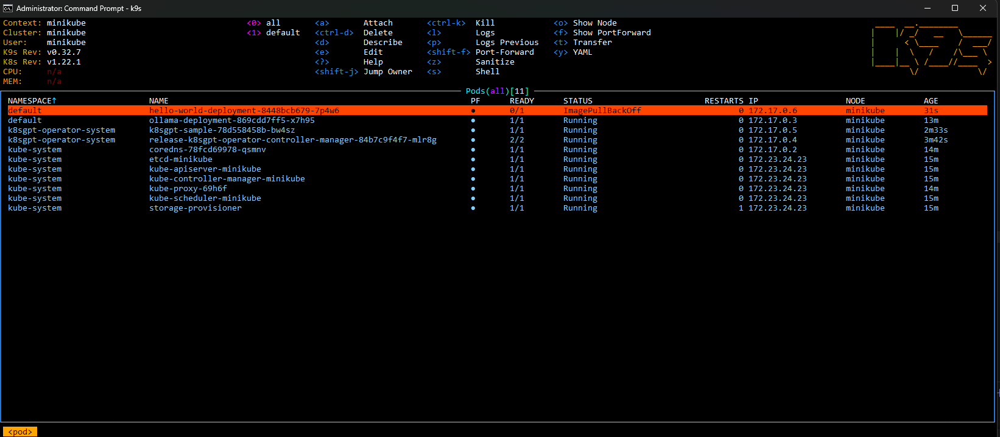
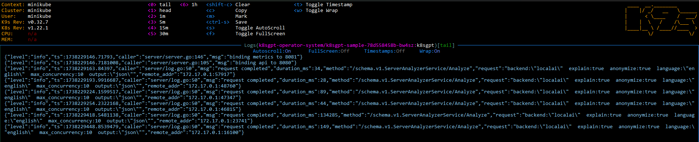
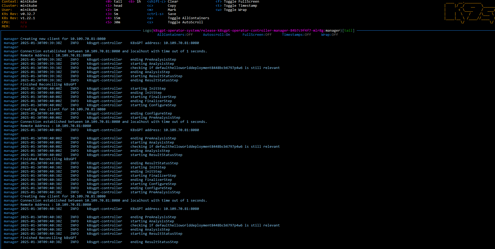
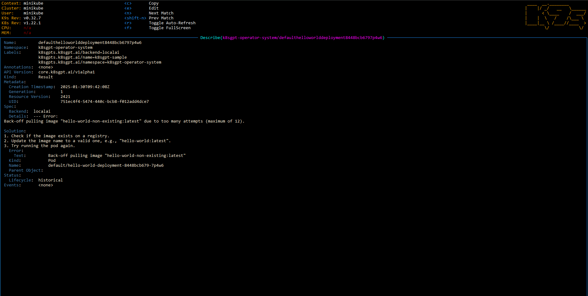
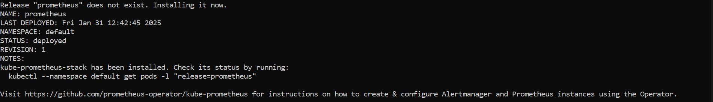
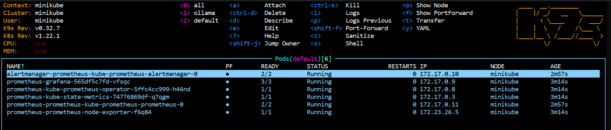
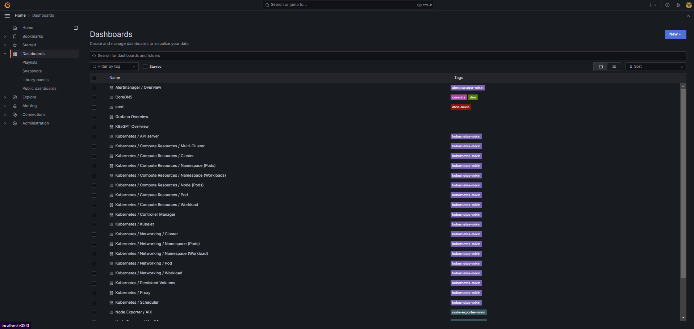
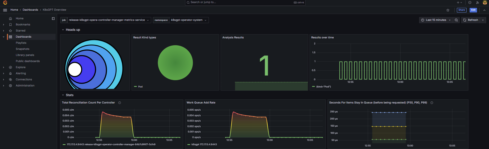

# Integrating k8sgpt-ai with a local k8s cluster #

## Example local k8s clusters ##
- ### Minikube
  - For this POC I allocated 7GB of ram to minikube but you can go lower
- ### Rancher Desktop
- ### Docker Desktop

## Requirements
- Kubernetes Cluster
  - Minikube
    - For this POC I allocated 7GB of RAM to Minikube, but it might work ok with less
  - Rancher Desktop
  - Docker Desktop
- helm
- kubectl
- Optionally k9s or any other UI for kubernetes

## Steps for k8sgpt-ai Integration
- kubectl apply -f ./ollama.yml
  - This will create a deployment using the ollama/ollama:latest image
  - That is where the AI model will be hosted
  - The k8sgpt operator will need to access this pod so a service is also created
- shell into the ollama pod to run the following command: <b><i>ollama pull llama3.2</i></b>
  - The model used for this POC is lightweight with 3b parameters, but can be changed to an even lighter one with 1b parameters if resources are scarce
  - You can try to use another model from https://ollama.com/library, keep in mind that bigger models will need more resources available
  - If you choose another model, then you must update k8sgpt.yml where the model is specified
- helm chart for k8sgpt-ai
  - helm repo add k8sgpt https://charts.k8sgpt.ai/ 
  - helm repo update
  - helm install release k8sgpt/k8sgpt-operator -n k8sgpt-operator-system --create-namespace
    - these will install the k8sgpt operator for the cluster
- kubectl apply -f ./k8sgpt.yml
  - This pod will work together with the operator to interact with the AI model
- If everything is configured correct up to this point, we can now introduce problems into the cluster for the k8sgpt to analyze
  - To do this we have the hello.yml which would normally create a hello world pod, but the image is misconfigured and the pod will be unable to pull it
    
  - K8sgpt will periodically scan the cluster for issues, so once the error appears it will start analysis and return objects called Results
    
    
  - Inside these objects we might find steps on possible causes and how to begin remediating the issue
    
    

### The basic idea of this integration is to get a head start on detecting issues and resolving them with the help of AI. If we hosted more advanced models we might get even better results.

## Steps for integrating monitoring with Prometheus/Grafana/AlertManager
- helm chart for prometheus stack
  - helm repo add prometheus-community https://prometheus-community.github.io/helm-charts
  - helm repo update
  - helm upgrade --install prometheus prometheus-community/kube-prometheus-stack --set prometheus.prometheusSpec.serviceMonitorSelectorNilUsesHelmValues=false --wait
    - serviceMonitorSelectorNilUsesHelmValues makes sure Prometheus only scrapes metrics from specific ServiceMonitors that match a specific selector. This is useful if you want to limit monitoring scope
  - Output of command should look like this
  
  - You should now be able to see pods have been created
  
  - To integrate k8sgpt with Prometheus we now need to add some configurations to the k8sgpt deployment. We can do that with the following command:
    - helm upgrade release k8sgpt/k8sgpt-operator -n k8sgpt-operator-system --create-namespace --set interplex.enabled=true --set grafanaDashboard.enabled=true --set serviceMonitor.enabled=true
  - Now that the prometheus stack is deployed, we can port forward the Grafana pod to see our metrics
    - kubectl port-forward svc/prometheus-grafana 3000:80
    - Credentials
      - Username: admin
      - Password: prom-operator
    - We can see the k8sgpt dashboard available to view called K8sGPT Overview. These metrics and default dashboard are provided by the k8sgpt operator.
    
    

## Though this is a small example, we can imagine how this might work on a cluster that's being used by multiple people, possibly integrating this with slack for alerts, identifying issues in real time and offering ideas on how to fix them

### Relevant links:
- https://docs.k8sgpt.ai/getting-started/in-cluster-operator/
- https://github.com/ollama/ollama
- https://hub.docker.com/r/ollama/ollama
- https://github.com/k8sgpt-ai/k8sgpt-operator
- https://github.com/prometheus-community/helm-charts